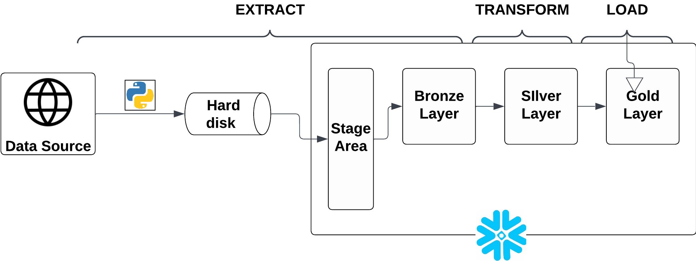

# NYC_Taxi_Trip
### Introduction 

In this project, the primary focus involves building a pipeline that will ingest, transform and aggregate the NYC trip data. To aid this process, python was used to download the parquet file to my local storage and snowsql command line was use to input the data from my local storage to a stage area in Snowflake, which served as a temporary storage for the ELT process.

### TOOL UTILIZED
Vscode - Extract data from NYC trip data website
Snowflake - ELT process
Lucid Chart - Data architecture design

### LANGUAGE USED
Python
SQL

### DATA ARCHITECTURE

